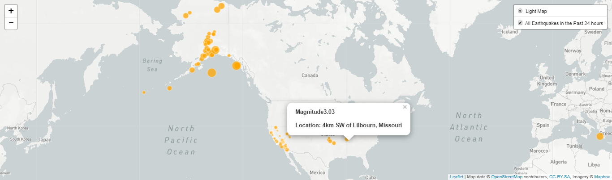

# leaflet-challenge
HW-17_Mapping

## Level 1: Basic Visualization

Your first task is to visualize an earthquake data set.

### Get your data set

The USGS provides earthquake data in a number of different formats, updated every 5 minutes. 

Visited the USGS GeoJSON Feed page and picked the all data data set to visualize (I attempted the last 30 days, but the amount of data was too much, taking a while to load results on the map). 

When you click on a data set, for example 'All Earthquakes from the Past 24 hours', you will be given a JSON representation of that data. Used the URL of this JSON [https://earthquake.usgs.gov/earthquakes/feed/v1.0/summary/all_day.geojson] to pull in the data for visualization.

### Import & Visualize the Data

Created a map using Leaflet that plots all of the earthquakes from the data set based on their longitude and latitude.

Data markers should reflected the magnitude of the earthquake in their size. Earthquakes with higher magnitudes appear larger.
Included popups that provide additional information about the earthquake when a marker is clicked.

Created a legend that will provide context for your map data.
